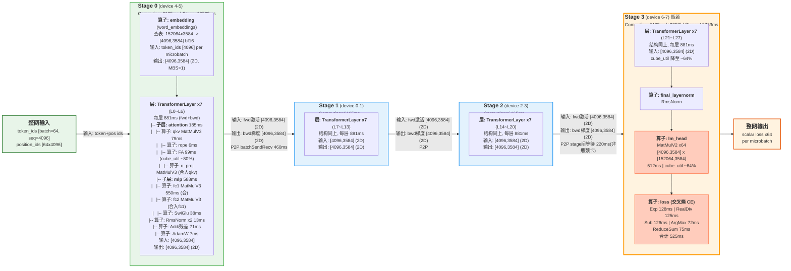

# 视图1：MFU 拆解 × profile_dir 耗时对照

> 数据源：`profile_dir`（dense Qwen2.5‑7B，TP1·PP4·DP2，AdamW，Ascend 2节点×4卡）
> 代表卡：**device 6 = 末级 PP stage**（含 lm_head `MatMulV2` + 交叉熵 `ArgMaxWithValue/Exp/Log`），即报告标记的瓶颈卡 / 关键路径
> 单位：**ms / iter**（profiling 抓取的 step3、step4 两步均值）
> 迭代(Stage) ≈ **10763 ms**；其中 Computing 9422 / 未掩盖通信 1093 / Free 248

---

## 0. 原始 MFU 拆解清单（`拆解`）

```
## mfu拆解细项，求耗时（ms）和占比

PP/VPP
    未掩盖send/receive通信
    PP空泡
    stage间等待

通信
    DP未掩盖通信（包含muon）
    DP通信，其他通信做差
    EP未掩盖通信
    EP通信
    TP通信
    step拖尾同步通信

优化器更新
    cube计算
    vector计算
    未掩盖通信（zero域）

CUBE
    除去FA和优化器部分的cube运算
    除去FA和优化器部分的cube运算，包括mc2

FA
    前向+前向重计算+反向
    FA+FAG

Vector
    MHC 融合算子前向2.4*2+反向10.7+5.4
    MHC 融合算子仅考虑hc融合部分，小算子拼接部分未考虑
    MOME 融合算子前向0.565+0.65，反向1.0+0.822
    router+permute 融合算子前向4.17+反向7.1
    耗时最大的一个融合算子的耗时
    耗时最大的一个算子的耗时
    loss计算
    muon优化器更新
    mla，rope等其他vector

free

误差

当前MFU
```

---

## 1. 一个前置结论

`拆解` 是一份面向**大 MoE + MLA + muon 模型**的通用 MFU 模板，而 `profile_dir` 是一份 **dense Qwen2.5‑7B** 跑批（TP1·PP4·DP2，优化器为 AdamW）。
因此模板中一整块条目（**EP / router+permute / MHC / MOME / MLA / muon**）在本 profile 中**没有对应算子**，读出来就是 0 / N‑A，**读再多源码也读不出**——这点本身就是结论。

## 1.1 为什么"拆耗时"能代表 MFU

### 术语

- **iter** = iteration，一个训练步（一次 forward + backward + optimizer update）
- **T_iter** = 一个 iter 的墙上耗时，本文 T_iter ≈ 10763 ms

### 公式① 定义

$$\text{MFU} = \frac{\text{实际算力}}{\text{峰值算力}} = \frac{\text{模型FLOPs} \;/\; T_{\text{iter}}}{\text{峰值FLOPS}} = \frac{\text{模型FLOPs}}{T_{\text{iter}} \times \text{峰值FLOPS}}$$

其中：

- **实际算力** = 模型 FLOPs / T_iter ——"这步训练实际跑出了多少 FLOPS"
- **峰值算力** = 芯片标称峰值 FLOPS（Ascend 910B2 的 FP16 ≈ 320 TFLOPS）

例如：模型一步需要 $10^{12}$ FLOPs，跑了 0.01s，那实际算力就是 $10^{14}$ FLOPS = 100 TFLOPS；如果峰值是 320 TFLOPS，MFU = 100/320 ≈ 31%。

### 公式② 观察：唯一自由变量是 T_iter

分子（每 iter 的 FLOPs）由模型结构决定，基本固定——参数量、层数、hidden dim、seq_len、batch_size 一旦确定，一次 forward+backward 所需的浮点运算次数就是常数（对 dense transformer，近似 $6 \times \text{参数量} \times \text{token数}$，即 $6ND$）。对同一模型、同一芯片，**MFU 好坏只看 T_iter**——T_iter 越大分母越大，MFU 越低。因此"拆 MFU"等价于"拆 T_iter"，这也是整篇耗时拆解的动机。

### 公式③ 分解：把 T_iter 拆成两段

令 **T_compute** = 一个 iter 里真正在做"计入 FLOPs 的 cube/FA 计算"的时间，则：

$$
\begin{aligned}
\text{MFU}
&= \frac{\text{模型FLOPs}}{T_{\text{iter}} \times \text{峰值FLOPS}} \\[6pt]
&= \underbrace{\frac{\text{模型FLOPs}}{T_{\text{compute}} \times \text{峰值FLOPS}}}_{\text{算子达成率}}
\;\times\;
\underbrace{\frac{T_{\text{compute}}}{T_{\text{iter}}}}_{\text{计算占用率}}
\end{aligned}
$$

| 因子 | 公式 | 对应拆解模板中的细项 | 本 profile 示意 |
|---|---|---|---|
| **算子达成率** | $\dfrac{\text{模型FLOPs}}{T_{\text{compute}} \times \text{峰值FLOPS}}$ | **CUBE**（除去FA和优化器的MatMul）、**FA**（前向+重计算+反向）——这些算子的实际吞吐决定达成率 | stage0 ~80%, stage3 ~64% |
| **计算占用率** | $\dfrac{T_{\text{compute}}}{T_{\text{iter}}}$ | 分子 $T_{\text{compute}}$ = CUBE + FA 耗时；分母 $T_{\text{iter}}$ = CUBE + FA + **PP**(空泡/通信) + **DP/TP/EP通信** + **优化器更新**(cube/vector/通信) + **Vector**(loss/rope等) + **free** + **误差**。占用率越低 = 陪跑项占比越大 = MFU 被稀释越严重 | 总 iter 10763 ms，Computing 9422 ms 里还要再剔除非计费算子，实际 $T_{\text{compute}}$ 更小 |

### 拆解的意义

耗时拆解做的就是第二项的归因：把 **(1 − 计算占用率)** 这部分"陪跑时间"具体分给 PP 空泡、DP/TP 通信、优化器、以及 vector 里的 loss/rope 等零碎算子——这些操作虽然真实占用设备时间、拉低 MFU，但**不产生被 MFU 公式计入的 FLOPs**（RmsNorm/Add/loss/优化器更新通常不计入标准 FLOPs 公式），对 MFU 的伤害和纯 idle 空泡是一回事。

所以拆解的意义不在于"算出 MFU 这一个数字"（这只需一个数字就够了），而在于**定位哪一类耗时在偷 MFU**：是该去压 PP bubble（报告口径 ≈35%），还是减 DP allReduce 未掩盖通信（862ms），还是把 loss/rope 这类零碎 vector 算子融合掉——这也是第 3 节对照表与第 4 节要点的出发点。

## 2. 两列口径的含义

- **② profile_dir 直接读出**：profiler 已经替你打好标签、无需任何模型源码即可读到的数字。来自三类聚合：
  - `step_trace_time.csv` 的 5 个桶（Computing / Communication(Not Overlapped) / Free / Stage / Bubble）
  - `op_statistic.csv` 的「按算子类型」耗时（MatMul、FA、SwiGlu、ApplyAdamW…）
  - `communication.json` 的「按通信算子」耗时（batchSendRecv=p2p、allReduce、allGather）
  → 给的是**算子层**数字，不是 MFU 的**逻辑模块**数字。
- **③ 结合源码后进一步可读**：需要叠加模型结构 / 并行组配置 / FLOPs，才能对原始算子数据做**重分组、拆分、域归属**得到的数字。

---

## 3. 对照表（device 6，ms/iter）

| MFU 拆解细项 | ② profile_dir 直接读出 (ms/iter) | ③ 结合源码后进一步可读 (ms/iter) |
|---|---|---|
| **PP/VPP** | | |
| 　未掩盖 send/receive 通信 | `communication.json`: p2p(batchSendRecv) elapse **460.3**；`step_trace`: CommNotOverlapped **1092.9**（含所有通信类型，无法拆分 send/recv） | 无补充作用 |
| 　PP 空泡 | 无对应数据（`step_trace` Bubble 列恒为 **0**，profiler 未计算） | **≈ 3767**（≈35% × T_iter，基于 1F1B 调度 + 末级 lm_head/loss 负载估算） |
| 　stage 间等待 | `communication.json`: p2p wait，device 6（关键路径）≈ **0**；device 4 ≈ **220** | 无补充作用 |
| **通信** | | |
| 　DP 未掩盖通信(含muon) | `communication.json`: allReduce elapse **862.1**（wait 390.8） | muon = **0**（源码确认优化器为 AdamW）；DP 域归属确认（排除 TP/EP/zero） |
| 　DP通信，其他通信做差 | 无直接对应（此为推导项，非 profile 字段） | 总通信 − PP − zero 后可得 DP 通信净值（需源码确认各域归属） |
| 　EP 未掩盖通信 / EP 通信 | 不涉及（dense 模型，`op_statistic` 无 EP 算子，`communication.json` 无 EP 通信组） | 无补充作用 |
| 　TP 通信 | 不涉及（TP=1，`communication.json` 无 allGather/reduce-scatter） | 无补充作用 |
| 　step 拖尾同步通信 | `communication.json`: allReduce__346 elapse **352**（末尾同步） | 源码确认用途：**grad-norm / 末级同步** |
| **优化器更新** | | |
| 　cube 计算 | 无对应数据（`op_statistic` 无优化器相关 cube 算子） | **0**（源码确认 AdamW 无 cube 操作） |
| 　vector 计算 | `op_statistic`: ApplyAdamWV2 **52.0** + LpNormV2(grad-clip) **11.9** | 合计 ≈ **64**（源码确认均属优化器更新） |
| 　未掩盖通信(zero域) | `communication.json`: allGather **0.7** | 属 zero 域（源码确认 distributed-optimizer 配置） |
| **CUBE** | | |
| 　除去FA和优化器部分的cube | `op_statistic`: MatMulV3(AI_CORE+MIX_AIC) **5936.3** + MatMulV2 **512.1** = **6448.4** | 无需修正 = **6448.4**（源码确认 FA 和优化器均不含 MatMul，总和即净 cube） |
| 　…包括 mc2 | 不涉及（TP=1，无 mc2 融合通信） | 无补充作用 |
| **FA** | | |
| 　前向+前向重计算+反向 | `op_statistic`: FlashAttentionScore **219.6** + FlashAttentionScoreGrad **503.3** = **722.9** | 前向重计算含在 219.6 内（源码确认重计算开启），无法从 profile 进一步拆分 |
| 　FA+FAG | **722.9**（同上） | 无补充作用 |
| **Vector** | | |
| 　MHC 融合算子 | 不涉及（dense 模型，`op_statistic` 无此类算子） | 无补充作用 |
| 　MOME 融合算子 | 不涉及（同上） | 无补充作用 |
| 　router+permute 融合算子 | 不涉及（无 MoE） | 无补充作用 |
| 　耗时最大的一个融合算子 | `op_statistic`: 无融合算子；最大 vector 单算子为 `Add` **658.3** | 无补充作用 |
| 　耗时最大的一个算子 | `op_statistic`: MatMulV3 **5936.3**（按类型）；`kernel_details`: 单 kernel 实例最大 ≈ **18.8** | 无补充作用 |
| 　loss 计算 | `op_statistic`: Exp **128.3** + RealDiv **125.0** + Sub **125.5** + ArgMaxWithValue **71.7** + ReduceSum **75.0** + … | 聚合 ≈ **525**（源码确认均属末级 CE loss） |
| 　muon 优化器更新 | 不涉及（`op_statistic` 仅有 ApplyAdamWV2，无 muon 算子） | 无补充作用 |
| 　mla, rope 等其他 vector | `op_statistic`: Rope **18.7** + RopeGrad **22.5** = **41.2**；MLA 不涉及 | MLA = **0**（源码确认无 MLA 模块） |
| **free** | `step_trace`: Free **248.4** | 无补充作用 |
| **误差** | 无直接对应（推导项） | Stage − Σ(已归类)（需完整归类后做差） |
| **当前 MFU** | `kernel_details`: MatMul cube 利用率 stage0 **~80%** / stage3 **~64%**（芯片 910B1，峰值 378.88 TFLOP/s） | 端到端 MFU ≈ 达成率 × 占用率 ≈ **40%+**；FA FLOPs 并入需确认 sparse_mode |

---

## 4. 要点

1. **能"直接读"的本质是三类聚合**：step_trace 的 5 个桶、op_statistic 的按算子类型耗时、communication.json 的按通信算子耗时。它们给的是**算子层**数字，不是 MFU 的**逻辑模块**数字。
2. **源码的作用是"重分组 / 拆分 / 归属"**：把 cube 净化（除去 FA/优化器）、把通信归到 DP/TP/EP/zero 域、把零碎 vector 小算子聚成 loss、把 FA 前向与重计算分开、量化 PP 空泡、再用 FLOPs 算 MFU。这些都**不是 profile 里现成的数字**。
3. **本 profile 对该模板严重"缺项"**：EP / router+permute / MHC / MOME / MLA / muon 全部不存在（dense + TP1 + AdamW），无论怎么读源码都读不出——这点本身就是结论。
4. **逐卡差异**：表中用末级（瓶颈）卡 device 6。PP 空泡 / stage 等待主要体现在**非瓶颈卡**（如 device 4 的 p2p wait≈220ms、tail allReduce≈352ms），瓶颈卡上≈0。做整网 MFU 拆解时应以关键路径（本卡）为准，等待/空泡计入其它卡的占比。

---

## 附：口径与校验

- **算子层自洽**：Computing 9422 ≈ cube(MatMul 6448) + FA(723) + vector(2251)。
- **迭代自洽**：Computing 9422 + 未掩盖通信 1093 + Free 248 = Stage 10763。
- **归一化**：op_statistic / step_trace / communication.json 均覆盖 step3+step4 两步，表内数值已 ÷2 换算为每 iter，并由 us 换算为 ms。

---

# 视图2：整网结构与层、模块统计：层 → module → 算子（MFU 拆解的结构底座）

上面的对照表是「算子类型 → MFU 逻辑模块」的横向归类；本节补「网络纵向结构」——哪些层、每层哪些 module、每个 module 下哪些算子，这是把 MatMul 等聚合数字进一步拆到 attention/mlp 的前提。

### 5.1 骨架

```
GPT model (Qwen2.5-7B, mcore)
├─ embedding: word_embeddings (vocab 152064 × 3584)         ← 仅 stage0
├─ decoder: 28 × TransformerLayer  ← PP4 均匀切成 [7,7,7,7]
│   每层 TransformerLayer:
│   ├─ input_layernorm           → RmsNorm
│   ├─ self_attention
│   │   ├─ linear_qkv            → MatMulV3
│   │   ├─ rotary_pos_emb (Q,K)  → RotaryPositionEmbedding
│   │   ├─ core_attention        → FlashAttentionScore  (GQA: 28 heads / kv4 / head_dim128)
│   │   └─ linear_proj (o)       → MatMulV3
│   ├─ pre_mlp_layernorm         → RmsNorm
│   └─ mlp (SwiGLU)
│       ├─ linear_fc1 (gate+up)  → MatMulV3
│       ├─ activation            → SwiGlu
│       └─ linear_fc2 (down)     → MatMulV3
└─ final_layernorm + output_layer(lm_head 3584×152064) + loss(CE)  ← 仅 stage3
```

### 5.2 三级耗时表（device 4 = stage2，7层纯transformer，ms/iter）

> 数据源：device 4 的 `op_statistic.csv`（算子总耗时）+ `kernel_details.csv`（Input Shapes 区分 attention/MLP MatMul）；结构归属来自 MindSpeed-LLM `transformer_layer.py` 源码。耗时 = step3+step4 均值 ÷2。选 stage2 是为了避开 stage0 的 embedding 和 stage3 的 lm_head/loss，看「纯 transformer 层」的内部构成。

**MatMulV3 拆分依据**：`kernel_details.csv` 中 MatMulV3 按 Input Shapes 分为 4 类（以 device 5 为例，device 4 同）：

| Shape（A ; B） | 输出 | 归属 | K×N |
|---|---|---|---|
| `4096,3584 ; 4608,3584` | `4096,4608` | **attention qkv**（4608=3584+512+512，GQA kv4） | 3584×4608 |
| `4096,3584 ; 3584,3584` | `4096,3584` | **attention o_proj** | 3584×3584 |
| `4096,3584 ; 37888,3584` | `4096,37888` | **mlp fc1**（37888=2×18944，SwiGLU gate+up） | 3584×37888 |
| `4096,18944 ; 3584,18944` | `4096,3584` | **mlp fc2**（18944→3584，down） | 18944×3584 |

FLOPs 比 attention:mlp ≈ (3584×4608+3584×3584) : (3584×37888+18944×3584) = 8192 : 56832 ≈ **1 : 6.94**，以此拆分 MatMulV3 总耗时 4405ms → attention **≈555ms** + mlp **≈3850ms**。

---

| 一级：层 / 模块 | 二级：子模块 | 三级：算子 (fwd+bwd) | 7层合计 (ms) | 单层均值 (ms) | 占Computing% |
|---|---|---|---|---|---|
| **embedding** | — | — | —（仅 stage0） | — | — |
| **TransformerLayer ×7** | | | **≈6165** | **≈881** | **100%** |
| | input_layernorm | RmsNorm + RmsNormGrad | 93.5 | 13.4 | 1.5% |
| | self_attention | | **≈1293** | **≈185** | **21.0%** |
| | 　├ linear_qkv | MatMulV3 | ≈555 | ≈79 | 9.0% |
| | 　├ rotary_pos_emb | RotaryPositionEmbedding + Grad | 40.5 | 5.8 | 0.7% |
| | 　├ core_attention | FlashAttentionScore + Grad | 693 | 99 | 11.2% |
| | 　└ linear_proj | ↳ 已合入上方 MatMulV3 | — | — | — |
| | pre_mlp_layernorm | RmsNorm + RmsNormGrad | ↳ 已合入上方 RmsNorm | — | — |
| | mlp (SwiGLU) | | **≈4115** | **≈588** | **66.7%** |
| | 　├ linear_fc1 | MatMulV3 | ≈3850 | ≈550 | 62.4% |
| | 　├ activation | SwiGlu + SwiGluGrad | 264.5 | 37.8 | 4.3% |
| | 　└ linear_fc2 | ↳ 已合入上方 MatMulV3 | — | — | — |
| | (残差/杂项) | Add + Mul + Cast + Slice + … | ≈500 | ≈71 | 8.1% |
| | (优化器) | ApplyAdamWV2 + LpNormV2 | 48 | 6.9 | 0.8% |
| **final_layernorm + lm_head + loss** | — | — | —（仅 stage3） | — | — |
| | lm_head | MatMulV2 | — | 512（device 6） | — |
| | loss (CE) | Exp+RealDiv+Sub+ArgMax+ReduceSum+… | — | ≈525（device 6） | — |

> **说明**：
> - 「单层均值」= 7层合计 ÷ 7。实际各层因 microbatch 调度（1F1B）的 bubble 差异，耗时并不均匀，此处为算术平均。
> - 「占Computing%」以 device 4 的 Computing=6165ms 为分母。
> - `input_layernorm` 和 `pre_mlp_layernorm` 的 RmsNorm 在 `op_statistic` 中合并统计（count=896×2），无法拆分，故归为一行。
> - `linear_qkv` 和 `linear_proj` 的 MatMulV3、`linear_fc1` 和 `linear_fc2` 的 MatMulV3 同理合并，拆分靠 FLOPs 比估算。
> - lm_head (MatMulV2) 和 loss(CE) 仅在末级 stage3（device 6/7），此处单列不计入 stage2 占比。

### 5.3 结构项的真实 / 构造标注

| 结构项 | 状态 | 依据 |
|---|---|---|
| 每 stage **7 层**、PP4 → **共 28 层** | ✅ **锚定（真实）** | 8 卡 `op_statistic` 中 `FlashAttentionScore` count 全 = **448 = 7×64**；`lm_head MatMulV2` count = **64** = microbatch 数 → 7 层/stage × 4 = 28。**把原 config 标 [构造] 的 num_layers=28 升级为真实可证** |
| 每层 2× RmsNorm、QK 各一次 rope | ✅ **锚定** | `RmsNorm` count=**896=7×2×64**；`RotaryPositionEmbedding` count=**896=7×64×2** |
| module 组成（attention/mlp/norm）与算子种类 | ✅ **锚定（结构）+ 源码** | 算子种类来自 kernel_details；module 归属来自 MindSpeed-LLM `transformer_layer.py` |
| lm_head 仅 stage3 | ✅ **锚定** | 仅 rank6/7 有 `MatMulV2`×64（avg 16ms），rank0–5 无 |
| GQA 28/kv4/head_dim128、hidden3584、vocab152064 | ✅ **锚定** | profiling shape 反推 |
| **ffn_hidden=18944、rope_theta、rms_eps** | ⚠️ **构造** | 取 Qwen2.5-7B 公开 config，未从落盘确证 |
| **microbatch=64 vs 32** | ⚠️ **部分构造** | lm_head×64 锚定为 64，但与 GBS/(MBS·DP)=32 的关系待真实日志核对 |

### 5.4 module 级耗时/占比（rank4 = stage2 纯 transformer 中间级，含 fwd+bwd，计算 kernel 口径）

> 选中间级 stage 是为了避开 lm_head/loss 干扰，看「一个纯 transformer stage」的 module 占比。

| module | 算子(fwd+bwd) | count | 占比 |
|---|---|---|---|
| 所有 Linear（qkv/o/fc1/fc2） | `MatMulV3` | 4928+448 | **71.4%** |
| self_attention 核 | `FlashAttentionScore`(+Grad) | 448+448 | **11.2%** |
| 残差/bias/梯度累加 | `Add` | 6502 | 8.1% |
| mlp 激活 | `SwiGlu`(+Grad) | 448+448 | **4.3%** |
| layernorm | `RmsNorm`(+Grad) | 896+896 | **1.5%** |
| 优化器 | `ApplyAdamWV2`+`LpNormV2` | 98+100 | 0.78% |
| rope | `RotaryPositionEmbedding`(+Grad) | 896+896 | **0.65%** |
| 杂项 | Mul/Cast/TensorMove/ReduceSum/ZerosLike/Slice/Cos/Sin… | — | ~1.8% |
| (末级额外) lm_head | `MatMulV2`×64 | — | **5.4%**（仅 rank6/7） |

**当前局限**：上表按「算子类型」聚合，未拆分 MatMulV3 的 attention/mlp 归属。**该拆分已在 5.2 节通过 `kernel_details.csv` 的 Input Shapes 完成**（FLOPs 比 attention:mlp ≈ 1:6.94）。但 `op_statistic` 仍无法定位到具体第几层——这需要 `kernel_details.csv` 的 `Task ID`/`Stream ID` 配合 `trace_view.json` 的调用时序，或 `FRAMEWORK/torch.python_module_call`（profile_dir 的 FRAMEWORK 只有 op_mark/op_range，模块调用层级需走 trace_view；level2/ 与 MultiProfLevel2MemoryUB_db/ 才带 python_module_call）。

### 5.5 构建「整网信息」所必需依赖的文件

| 目的 | 必需文件 | 本仓状态 |
|---|---|---|
| 结构骨架（多少层、每层哪些 module） | `config.json`（层数/hidden/heads/GQA/ffn/vocab） | ⚠️ 仅**构造版** `reconstructed_inputs_CONSTRUCTED/qwen2.5-7b-hf_config.CONSTRUCTED.json`；层数已被 profiling 反证 |
| PP 切分（每 stage 几层、lm_head 在哪级） | 启动脚本 + 训练 stdout 日志 | ⚠️ 仅**构造版**；已被 8 卡 op_statistic 的 count 锚定替代 |
| module→算子 的语义结构 | MindSpeed-LLM/Megatron 源码（transformer_layer/block、attention、mlp） | ✅ `性能问题定位分析/_src/MindSpeed-LLM/` |
| 真实算子清单 + 耗时/占比 | `op_statistic.csv` | ✅ profile_dir 每卡 |
| 算子→具体 module/层 的精确归属 | `kernel_details.csv`(shape) + `trace_view.json` 或 `FRAMEWORK/torch.python_module_call` | ✅ kernel_details 有；module_call 在 level2 / MultiProfLevel2MemoryUB_db |
| 并行度/rank/stage 确认 | `profiler_metadata.json` / `profiler_info_*.json` | ✅ profile_dir 每卡 |

**一句话**：`quick_start.md` 给不了整网信息；整网 = **profiling 落盘数据（op_statistic / kernel_details / metadata，全真实）+ MindSpeed-LLM 源码（module 结构）**；构造文件夹的 config/日志只是结构骨架的临时占位，其中层数/切分已被真实 profiling 反证，拿到真实文件替换即可全部落到真实。

### 5.6 整网流程视图

> 下图综合了「profiling 锚定值 + MindSpeed-LLM 源码结构 + 2 个构造文件（config.json / 启动脚本）」还原的完整网络拓扑与耗时分布。
> 标注 `[锚定]` 的 = profiling 落盘可证；`[构造]` 的 = 取自 Qwen2.5-7B 公开 config / quick_start 建议，真实可能略不同。

#### 5.6.1 流水线全景（PP4，28 层 → 7/7/7/7，1F1B 调度）



> - **Stage 3 是瓶颈**：在 7 层 transformer 之外额外扛 **lm_head + loss ≈1037ms**，导致 Computing 比中间级 stage 多 3257ms
> - **P2P 通信**：stage 间通过 `batchSendRecv` 传递激活/梯度，elapse≈460ms（device 6），关键路径上 wait≈0
> - **PP 空泡**≈35%（≈3767ms）：末级 stage3 因 lm_head/loss 负载不均 + 1F1B warm-up/cool-down 导致

#### 5.6.2 全层内部数据流（从 embedding 到 loss，fwd+bwd）

> 以一层 TransformerLayer 展开为代表，完整展示从输入 token 到 loss 的所有层级。

```mermaid
graph TD
    INPUT["<big><b>输入</b></big><br/>token_ids [4096] per microbatch<br/>position_ids [4096]"]

    subgraph EMBED["<b>层: embedding</b> (仅 stage0)"]
        EMB_OP["<b>算子: word_embeddings</b><br/>查表: [152064, 3584]<br/>输入: [4096] token_ids<br/>输出: [4096, 3584] bf16"]
    end

    subgraph LAYER["<b>层: TransformerLayer</b> x28 (L0~L27)<br/>每层 881ms | PP4: [7,7,7,7] | 仅展开 1 层"]

        subgraph ATTENTION["<b>子层: self_attention</b> 185ms | 21.0% of Computing"]
            N1["<b>算子: input_layernorm</b><br/>RmsNorm x128/層 (fwd64+bwd64)<br/>[4096,3584] -> [4096,3584] | 6.7ms"]
            QKV["<b>算子: linear_qkv</b><br/>MatMulV3 (AI_CORE+MIX_AIC)<br/>[4096,3584] x [4608,3584] -> [4096,4608]<br/>4608=Q3584+K512+V512, GQA 28h/kv4<br/>cube_util stage0~80% / stage3~64%"]
            ROPE["<b>算子: rotary_pos_emb</b><br/>Q x64 + K x64 (fwd+bwd) | 5.8ms"]
            FA["<b>算子: core_attention</b><br/>FlashAttentionScore x64 fwd + x64 bwd<br/>[4096,28,128] dot [4096,4,128] | 99ms"]
            OPROJ["<b>算子: linear_proj / o</b><br/>MatMulV3<br/>[4096,3584] x [3584,3584] -> [4096,3584]<br/>合入 qkv 统计 (FLOPs 比拆分)"]
        end

        subgraph MLP["<b>子层: mlp (SwiGLU)</b> 588ms | 66.7% of Computing"]
            N2["<b>算子: pre_mlp_layernorm</b><br/>RmsNorm x128/層 (fwd64+bwd64)<br/>[4096,3584] -> [4096,3584] | 合入上层 RmsNorm"]
            FC1["<b>算子: linear_fc1 (gate+up)</b><br/>MatMulV3<br/>[4096,3584] x [37888,3584] -> [4096,37888]<br/>37888=2x18944 | fwd=MIX_AIC, bwd=AI_CORE x2"]
            ACT["<b>算子: activation</b><br/>SwiGlu x64 fwd + SwiGluGrad x64 bwd | 37.8ms"]
            FC2["<b>算子: linear_fc2 (down)</b><br/>MatMulV3<br/>[4096,18944] x [3584,18944] -> [4096,3584]<br/>合入 fc1 统计 (FLOPs 比拆分)"]
        end

        N1 --> QKV --> ROPE --> FA --> OPROJ
        OPROJ -->|"+ 残差 Add"| N2
        N2 --> FC1 --> ACT --> FC2
    end

    subgraph HEAD_BLOCK["<b>层: final_layernorm + lm_head</b> (仅 stage3)<br/>1037ms 额外负载, 瓶颈根因"]
        FN["<b>算子: final_layernorm</b><br/>RmsNorm<br/>[4096,3584] -> [4096,3584]"]
        LM["<b>算子: lm_head</b><br/>MatMulV2 x64<br/>[4096,3584] x [152064,3584] -> [4096,152064]<br/>512ms | cube_util ~64%"]
        FN --> LM
    end

    subgraph LOSS_BLOCK["<b>层: loss (交叉熵 CE)</b> (仅 stage3)"]
        LOSS_OPS["<b>算子: loss 链</b><br/>Exp 128ms | RealDiv 125ms<br/>Sub 126ms | ArgMax 72ms<br/>ReduceSum 75ms<br/>合计 525ms"]
    end

    OUTPUT["<big><b>输出</b></big><br/>scalar loss per microbatch<br/>x64 梯度累积 -> GBS=64"]

    INPUT --> EMB_OP
    EMB_OP -->|"[4096,3584]"| N1
    FC2 -->|"+ 残差 Add [4096,3584]"| NEXT["<i>... 重复 x28 层 ...</i>"]
    NEXT --> FN
    LM --> LOSS_OPS
    LOSS_OPS --> OUTPUT

    style EMBED fill:#e8f5e9,stroke:#4caf50
    style LAYER fill:#f5f5f5,stroke:#9e9e9e,stroke-width:2px
    style ATTENTION fill:#e8eaf6,stroke:#3f51b5
    style MLP fill:#fce4ec,stroke:#e91e63
    style HEAD_BLOCK fill:#fff3e0,stroke:#ff9800,stroke-width:2px
    style LOSS_BLOCK fill:#fff3e0,stroke:#ff9800,stroke-width:2px
    style QKV fill:#c5cae9,stroke:#5c6bc0
    style OPROJ fill:#c5cae9,stroke:#5c6bc0
    style FC1 fill:#f8bbd0,stroke:#ec407a
    style FC2 fill:#f8bbd0,stroke:#ec407a
    style FA fill:#fff9c4,stroke:#f9a825
    style INPUT fill:#e8f5e9,stroke:#2e7d32,stroke-width:2px
    style OUTPUT fill:#e8f5e9,stroke:#2e7d32,stroke-width:2px
```



> **注**：耗时标注均为 fwd+bwd 合计（单层均值），数据来自 5.2 节。
>
> **层级关系**：`层: embedding` → `层: TransformerLayer x28`（内含 `子层: attention` + `子层: mlp`） → `层: final_layernorm + lm_head` → `层: loss`。
> embedding 仅在 stage0，final_layernorm/lm_head/loss 仅在 stage3，中间 stage1~2 只有 TransformerLayer。
>
> **为什么 shape 是 2D [4096, 3584] 而非 3D [B, S, H]？**
> - MBS=1：每个 microbatch 只含 1 条样本，64 个 microbatch 串行处理
> - 每层 Linear/MatMul 的输入即为 `[seq_len, hidden]` = `[4096, 3584]` 的 2D 矩阵
> - Megatron 流水线内激活传递一律为 2D（`[S, H]`），batch 维度通过 microbatch 串行体现
> - 这正是 `kernel_details.csv` 中所有 MatMul shape 均为 2D 的原因

#### 5.6.3 关键结构参数速查

| 参数 | 值 | 来源 |
|---|---|---|
| 层数 | **28** (PP4→7/7/7/7) | `[构造]` Qwen2.5-7B config → profiling count 吻合 (FA×448=7×64) |
| hidden_dim | **3584** | `[锚定]` kernel_details shape 指纹 |
| ffn_hidden | **18944** | `[构造]` Qwen2.5-7B config → MLP MatMul shape 37888=2×18944 吻合 |
| heads / kv_heads | **28 / 4** (GQA) | `[锚定]` FA shape + qkv shape 4608=3584+512+512 |
| head_dim | **128** | `[锚定]` 3584÷28=128 |
| vocab | **152064** | `[锚定]` lm_head MatMulV2 输出 shape |
| seq_len | **4096** | `[锚定]` 所有算子第一维 |
| microbatch | **64** | `[锚定]` lm_head MatMulV2 count=64 |
| TP/PP/DP/CP/EP | **1/4/2/1/1** | `[锚定]` profiler_metadata |
| 精度 | **bf16** | `[锚定]` 算子 DT_BF16 |
| 优化器 | **AdamW** (β1=0.9, β2=0.95) | `[构造]` 启动脚本 → op_statistic `ApplyAdamWV2` 吻合 |
| 总参数量 | **~7.6B** (7B dense) | `[构造]` Qwen2.5-7B 公开 |
