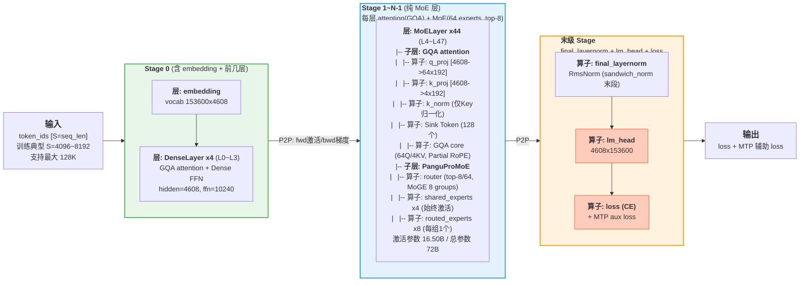
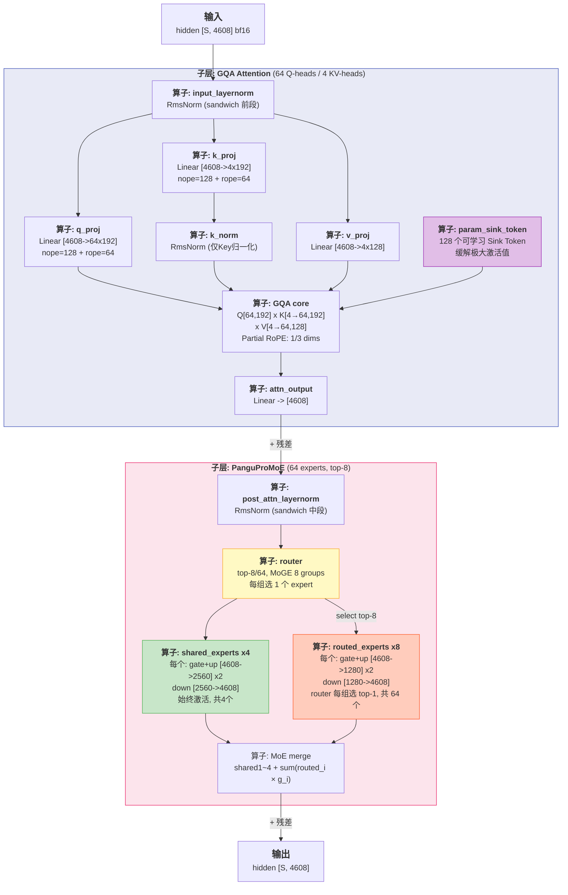

# Pangu Pro MoE 72BA16B 架构参考（MoE + GQA）

v 20260710 in PROLILINGTEST 项目

> 基于 arXiv `2505.21411v2` 论文与开源代码仓库整理。数据来源均为**公开可查**。
>
> **关于命名**：Pangu Pro MoE 72BA16B 是华为盘古团队发布的 MoE 语言模型，总参数量 72B，激活 16.50B。采用 GQA 注意力（非 MLA）+ MoGE 分组均衡路由，与 DeepSeek-V3 系列架构思路有显著差异。

## 1. 骨架

```
Pangu Pro MoE 72BA16B (72B total, 16.50B activated per token)
│
├─ embedding: token_embeddings (vocab 153600 × 4608)
│   └─ 是个层: 将 token id 查表映射为 4608 维向量，仅首层
│
├─ decoder: 48 × TransformerLayer
│   └─ 是个模块: 48层 decoder，每层都有 attention + FFN，但 FFN 类型分两种
│       ⚠️ Dense FFN 和 MoE FFN 是二选一的，同一层不会同时出现
│   │
│   ├─ Layer 0~3: Dense TransformerLayer (首4层)
│   │   └─ 是个层: 前4层为 Dense FFN 而非 MoE，用作输入初期特征提取
│   │
│   │   每层内部结构:
│   │   ├─ input_layernorm (sandwich_norm 前段)
│   │   │   └─ 是个算子: RmsNorm — 输入层归一化，Depth-Scaled 加权
│   │   │
│   │   ├─ self_attention (GQA + Partial RoPE + K-Norm + Sink Token)
│   │   │   └─ 是个子层: GQA 注意力 — 64 Q heads / 4 KV heads
│   │   │   ├─ q_proj
│   │   │   │   └─ 是个算子: Linear — Q 投影 [4608 → 64 × 192]，含 nope(128) + rope(64)
│   │   │   ├─ k_proj
│   │   │   │   └─ 是个算子: Linear — K 投影 [4608 → 4 × 192]，含 nope(128) + rope(64)
│   │   │   ├─ k_norm
│   │   │   │   └─ 是个算子: RmsNorm — 仅对 Key 做归一化（K-Norm，非 QK-Norm），稳定 attention logits
│   │   │   ├─ v_proj
│   │   │   │   └─ 是个算子: Linear — V 投影 [4608 → 4 × 128]
│   │   │   ├─ param_sink_token
│   │   │   │   └─ 是个算子: Sink Token — 可学习参数式 Sink Token (128个)，缓解极大激活值（10³→10²）
│   │   │   ├─ core_attention
│   │   │   │   └─ 是个算子: GQA Attention — Q[64,192] × K[4→64,192] × V[4→64,128]，
│   │   │   │       Partial RoPE: 仅 64/(128+64)=1/3 维度施加位置编码
│   │   │   └─ attn_output
│   │   │       └─ 是个算子: Linear — 注意力输出投影回 [4608]，+ 残差连接
│   │   │
│   │   ├─ post_attention_layernorm (sandwich_norm 中段)
│   │   │   └─ 是个算子: RmsNorm — attention 后归一化，Depth-Scaled 加权
│   │   │
│   │   └─ mlp (Dense FFN, SwiGLU)
│   │       └─ 是个子层: FFN 槽位放的是 Dense FFN — SwiGLU 激活的前向全连接
│   │       ├─ gate_proj
│   │       │   └─ 是个算子: Linear — gate 投影 [4608 → 10240]
│   │       ├─ up_proj
│   │       │   └─ 是个算子: Linear — up 投影 [4608 → 10240]
│   │       └─ down_proj
│   │           └─ 是个算子: Linear — down 投影 [10240 → 4608]，+ 残差连接
│   │
│   └─ Layer 4~47: MoE TransformerLayer (共44层)
│       └─ 是个层: 后44层，FFN 槽位换成了 MoE，attention 结构同 dense 层
│       │
│       │   每层内部结构 (attention 同 dense 层，仅 FFN 槽位不同):
│       │   ├─ input_layernorm (sandwich_norm 前段)
│       │   │   └─ 是个算子: RmsNorm — 同上
│       │   ├─ self_attention (GQA + Partial RoPE + K-Norm + Sink Token)
│       │   │   └─ 是个子层: GQA 注意力 — 结构同 dense 层，不再展开
│       │   ├─ post_attention_layernorm (sandwich_norm 中段)
│       │   │   └─ 是个算子: RmsNorm — 同上
│       │   │
│       │   └─ mlp (PanguProMoE)
│       │       └─ 是个子层: FFN 槽位放的是 PanguProMoE — 64 experts，top-8 路由，
│       │           MoGE 分组均衡：8 groups × 8 experts/group，每组激活 1 个
│       │       ├─ router
│       │       │   └─ 是个算子: Router — top-8/64，MoGE group-balanced 路由，
│       │       │       8 组各选 1 个，组间均衡负载
│       │       ├─ shared_experts ×4 (始终激活)
│       │       │   └─ 是个子模块: 共享专家 — 所有 token 都经过，捕获通用知识
│       │       │   ├─ gate_proj
│       │       │   │   └─ 是个算子: Linear — [4608 → 2560]
│       │       │   └─ up_proj
│       │       │       └─ 是个算子: Linear — [4608 → 2560]
│       │       └─ routed_experts ×64 (每 token 激活 8 个，每组 1 个)
│       │           └─ 是个子模块: 路由专家 — router 从 8 组中各选 top-1，共 8 个激活
│       │           ├─ gate_proj
│       │           │   └─ 是个算子: Linear — [4608 → 1280]，per expert
│       │           ├─ up_proj
│       │           │   └─ 是个算子: Linear — [4608 → 1280]，per expert
│       │           └─ down_proj
│       │               └─ 是个算子: Linear — [1280 → 4608]，per expert；
│       │                   MoE 输出 = shared_1~4 + Σ(routed_i × gate_i)，+ 残差连接
│
├─ final_layernorm (sandwich_norm 末段)
│   └─ 是个算子: RmsNorm — 最后一层归一化，位于 lm_head 之前，Depth-Scaled 加权
│
├─ output_layer (lm_head 4608 × 153600)
│   └─ 是个算子: Linear — 将 hidden 投影到 vocab 空间，输出 logits
│
└─ MTP module (num_mtp_layers=1)
    └─ 是个模块: Multi-Token Prediction — 额外预测后续 1 个 token
        └─ 训练时提供辅助 loss，推理时可做投机解码加速
```

## 2. GQA 注意力详解（区别于 MLA / MHA）

```
Pangu Pro MoE 72BA16B 采用 GQA (Grouped Query Attention)，而非 DeepSeek 的 MLA

传统 MHA:
  Q = X·W_Q  [4608 → 64×192]
  K = X·W_K  [4608 → 64×192]
  V = X·W_V  [4608 → 64×128]

Pangu Pro MoE GQA (64 Q heads, 4 KV heads):
  Q: X → [4608 → 64×192]        ← Q 头数多，细粒度语义捕获
  K: X → [4608 → 4×192]         ← KV 头数减半，KV Cache 减少 37.5%
  V: X → [4608 → 4×128]

  对比 MHA: KV Cache 节省 = (64-4)/64 = 93.75% → 实际因 head_dim 增加约省 37.5%

Partial RoPE (仅 1/3 维度):
  Q/K 每头 dim=192，切分为:
    - nope=128 维: 不加 RoPE
    - rope=64 维:  施加 RoPE (rope_theta=25600000)

K-Norm (非 QK-Norm):
  仅对 Key 施加 RmsNorm，不归一化 Query:
    - 稳定 attention logits（效果类似 QK-Norm）
    - 计算开销更小（K-Norm 比 QK-Norm 少一半归一化）
    - Query scale 不受影响，表达更灵活

Param Sink Token (原创):
  在 attention 中引入 128 个可学习 Sink Token:
    - 吸收极大激活值，训练中最大激活从 10³ 降至 10² 量级
    - 提升训练稳定性，对后量化亲和
```

## 3. 整网流程视图

### 3.1 流水线全景（典型部署）



### 3.2 单层 MoE TransformerLayer（第 4~47 层，核心层）



## 4. 关键参数

| 参数 | 值 | 来源 |
|---|---|---|
| 层数 | **48** (4 dense + 44 MoE) | arXiv 2505.21411v2 |
| hidden_dim | **4608** | 同上 |
| ffn (dense) | **10240** (SwiGLU) | 同上 |
| ffn (MoE expert) | **1280** (SwiGLU) | 同上 |
| ffn (shared expert) | **2560** (SwiGLU) ×4 | 同上 |
| attention | **GQA**: 64 Q-heads / 4 KV-heads (16:1) | 同上 |
| QK head dim | nope=**128**, rope=**64** → total **192**/head | 同上 |
| V head dim | **128** | 同上 |
| MoE | **64** routed + **4** shared, top-**8**, MoGE 8 groups | arXiv 2505.21411v2 |
| vocab | **153600** (≈153K) | 同上 |
| 总参数 / 激活 | **72B / 16.50B** | arXiv 2505.21411v2 |
| 训练数据 | **~24T tokens** | README |
| 精度 | **BF16** (训练/推理) | config |
| MTP | **1** 层额外预测模块 | config |
| max seq_len | **131072** (128K) | config |
| RoPE theta | **25600000** | config |
| routed_scaling_factor | **2.5** | config |

## 5. 独特设计要点

### 5.1 Depth-Scaled Sandwich-Norm

```
传统 Pre-Norm:
  x → Norm → Attn → + residual → Norm → FFN → + residual

Sandwich-Norm (Pangu Pro MoE):
  x → Norm₁ → Attn → Norm₂ → + residual → Norm₃ → FFN → + residual
       ↑                ↑                    ↑
    前 sandwich      中 sandwich         后 sandwich
  
  Depth-Scaled: 每层的 Norm 权重随深度缩放，保证残差连接稳定性
```

### 5.2 K-Norm（非 QK-Norm）

| | QK-Norm | K-Norm |
|---|---|---|
| 归一化对象 | Query + Key | 仅 Key |
| 计算开销 | 2× RmsNorm | 1× RmsNorm |
| 稳定性效果 | ✅ | ✅（等同） |
| Query 灵活性 | Query scale 被归一化限制 | Query 保持原始 scale |

### 5.3 与 DeepSeek-V3 架构对比

| 维度 | DeepSeek-V3 | Pangu Pro MoE 72BA16B |
|---|---|---|
| 注意力机制 | **MLA** (低秩压缩) | **GQA** (分组查询) |
| KV Cache 压缩 | 低秩瓶颈 (kv_lora=512) | GQA 4 KV-heads |
| 位置编码 | RoPE (MLA 内置) | Partial RoPE (1/3 维度) |
| 归一化 | RmsNorm | K-Norm + Sandwich-Norm |
| Sink Token | 无 | 可学习 Sink Token ×128 |
| 总层数 | 61 | 48 |
| Dense 层 | 3 | 4 |
| Hidden | 7168 | 4608 |
| Q heads | 128 | 64 |
| KV heads | 128 (MLA 等效) | 4 (GQA) |
| Experts | 256 | 64 |
| Shared experts | 1 | 4 |
| 总参数 / 激活 | 671B / 37B | 72B / 16.50B |
| 负载均衡 | noaux_tc | MoGE group-balanced |
| 训练精度 | FP8 | BF16 |
| 快慢思考 | 无（单模式） | — |
